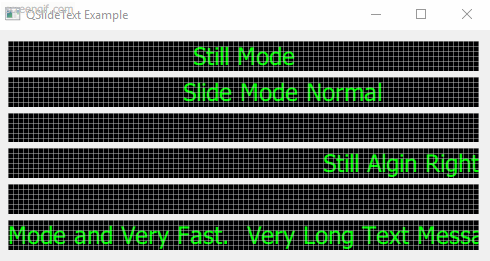

**NOTE** There are known defects in the current state of the code, cause this repostory is mainly working for a Qt programmer interview.

QSlideText
----------

QSlideText is a billboard like Qt widget which support static and sliding text.

# build

* Qt > 5.13.0
* CMake >= 3.5.0
* C++11

